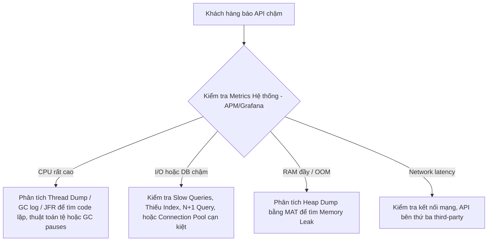

# Hướng Dẫn Ôn Tập & Bộ Câu Hỏi Phỏng Vấn Java Developer
> Tài liệu tổng hợp kiến thức trọng tâm dành cho chương trình **NAB Innovation Hub (Wecamp Batch 11)**.

---

## 📋 Mục lục
1. [Phần 1: Kiến thức nền tảng (Java Core)](#phần-1-kiến-thức-nền-tảng-java-core)
2. [Phần 2: OOP & Thiết kế Hướng đối tượng](#phần-2-oop--thiết-kế-hướng-đối-tượng)
3. [Phần 3: Cơ chế Bộ nhớ & Quản lý Biến (Memory Management)](#phần-3-cơ-chế-bộ-nhớ--quản-lý-biến-memory-management)
4. [Phần 4: Java Collections, Generics & Stream API](#phần-4-java-collections-generics--stream-api)
5. [Phần 5: Đa luồng và Xử lý đồng thời (Concurrency)](#phần-5-đa-luồng-và-xử-lý-đồng-thời-concurrency)
6. [Phần 6: Tối ưu hiệu năng & Xử lý sự cố (Performance Tuning)](#phần-6-tối-ưu-hiệu-năng--xử-lý-sự-cố-performance-tuning)
7. [Phần 7: Design Patterns & Kiến trúc hệ thống](#phần-7-design-patterns--kiến-trúc-hệ-thống)
8. [Phần 8: Frameworks (Spring Boot & JPA / Hibernate)](#phần-8-frameworks-spring-boot--jpa--hibernate)

---

## Phần 1: Kiến thức nền tảng (Java Core)

### 1. Sự khác nhau giữa JDK, JRE và JVM là gì?
*   **JVM (Java Virtual Machine):** Máy ảo Java, chịu trách nhiệm thực thi mã bytecode (.class). Nó giúp Java đạt được tính độc lập nền tảng (Write Once, Run Anywhere). JVM phụ thuộc vào hệ điều hành (có JVM riêng cho Windows, macOS, Linux).
*   **JRE (Java Runtime Environment):** Môi trường chạy Java, bao gồm **JVM** + các **thư viện core** (như `java.lang`, `java.util`) để chạy một ứng dụng Java.
*   **JDK (Java Development Kit):** Bộ công cụ phát triển Java, bao gồm **JRE** + các **công cụ phát triển** (như trình biên dịch `javac`, trình gỡ lỗi `jdb`, công cụ đóng gói `jar`).

### 2. Java “platform-independent” nhờ cơ chế nào?
*   **Cơ chế:** Khi bạn viết mã Java (`.java`), trình biên dịch `javac` biên dịch nó thành mã trung gian gọi là **Bytecode** (`.class`). Bytecode này không phụ thuộc vào bất kỳ phần cứng hay hệ điều hành cụ thể nào.
*   **Thực thi:** Khi chạy chương trình, JVM trên hệ điều hành tương ứng sẽ thông dịch hoặc biên dịch JIT (Just-In-Time) mã bytecode này thành mã máy cụ thể của hệ thống đó. Do đó, chỉ cần có JVM phù hợp, mã bytecode có thể chạy ở bất kỳ đâu.

### 3. Làm thế nào để biên dịch và chạy một file Java thủ công bằng CLI?
*   **Bước 1 - Biên dịch:** Sử dụng trình biên dịch `javac` để chuyển mã nguồn `.java` thành `.class` (Bytecode).
    ```bash
    javac MyClass.java
    ```
*   **Bước 2 - Thực thi:** Sử dụng JVM thông qua lệnh `java` để chạy file `.class` (không viết đuôi `.class`).
    ```bash
    java MyClass
    ```

### 4. Khác nhau giữa `==` và `equals()`? Khi nào override `equals()` thì cần override thêm gì?
*   **`==` (Toán tử so sánh):**
    *   Đối với kiểu dữ liệu nguyên thủy (primitive types): So sánh trực tiếp giá trị.
    *   Đối với kiểu dữ liệu đối tượng (reference types): So sánh địa chỉ vùng nhớ (tham chiếu) của hai đối tượng trên Heap (xem chúng có cùng trỏ tới 1 ô nhớ hay không).
*   **`equals()` (Phương thức):**
    *   Mặc định trong lớp `Object`, `equals()` cũng sử dụng toán tử `==` để so sánh địa chỉ.
    *   Tuy nhiên, nhiều lớp (như `String`, `Integer`, `Double`) đã override lại phương thức này để so sánh **giá trị nội dung** bên trong đối tượng.
*   **Quy tắc:** Khi override `equals()`, **bắt buộc** phải override phương thức `hashCode()`. Nếu không, hai đối tượng được coi là bằng nhau bằng phương thức `equals()` có thể trả về các mã hash khác nhau, dẫn đến hoạt động sai lệch trong các cấu trúc dữ liệu dựa trên bảng băm như `HashMap`, `HashSet`.

### 5. `hashCode()` liên quan gì đến `equals()`? Lỗi phổ biến khi override là gì?
*   **Mối quan hệ (Contract):**
    1.  Nếu `obj1.equals(obj2) == true` thì bắt buộc `obj1.hashCode() == obj2.hashCode()`.
    2.  Nếu `obj1.hashCode() == obj2.hashCode()`, hai đối tượng **không nhất thiết** phải bằng nhau bằng `equals()` (đây gọi là đụng độ mã băm - hash collision). Tuy nhiên, hiệu năng của Hash Map/Set sẽ tốt hơn nếu mã hash của các đối tượng khác nhau là khác nhau.
*   **Lỗi phổ biến:**
    *   Chỉ override `equals()` mà quên override `hashCode()`. Lúc này, hai đối tượng có cùng thuộc tính nhưng lại được lưu ở 2 bucket khác nhau trong `HashMap` vì mã hash mặc định dựa trên địa chỉ bộ nhớ là khác nhau.
    *   Tính toán `hashCode()` bằng các thuộc tính có thể thay đổi (mutable fields), khiến mã hash của đối tượng thay đổi sau khi đã đưa vào `HashMap/HashSet`, làm mất dấu đối tượng (không thể tìm hoặc xóa được nữa).

### 6. Vì sao String là immutable (bất biến)? Lợi ích và trade-off?
*   **Khái niệm:** Khi một đối tượng `String` được tạo ra, nội dung của nó không thể bị thay đổi. Mọi thao tác thay đổi chuỗi (như `concat()`, `replace()`, `substring()`) thực chất đều tạo ra một đối tượng `String` mới.
*   **Lợi ích:**
    *   **String Pool (Bộ nhớ đệm chuỗi):** Tiết kiệm dung lượng bộ nhớ Heap bằng cách chia sẻ các chuỗi có cùng nội dung.
    *   **Thread-Safety (An toàn đa luồng):** Vì trạng thái không thể thay đổi, nhiều thread có thể đọc chung một đối tượng String mà không cần đồng bộ hóa (synchronization).
    *   **Security (Bảo mật):** Chuỗi thường dùng làm tham số cho các kết nối mạng, đường dẫn file, database URL, tên đăng nhập/mật khẩu. Nếu String là mutable, kẻ tấn công có thể thay đổi giá trị của tham số sau khi đã kiểm tra tính hợp lệ.
    *   **Hashcode Caching:** Do String bất biến, `hashCode` chỉ cần tính toán một lần khi khởi tạo và cache lại, giúp tăng tốc độ truy xuất khi làm key cho `HashMap`.
*   **Trade-off:**
    *   Nếu ứng dụng thực hiện nhiều thao tác cộng chuỗi hoặc chỉnh sửa chuỗi liên tục (ví dụ trong vòng lặp lớn), nó sẽ tạo ra rất nhiều đối tượng String rác trên Heap, gây áp lực lớn cho Garbage Collector (GC).
    *   *Giải pháp:* Dùng `StringBuilder` hoặc `StringBuffer`.

### 7. Khác nhau giữa String, StringBuilder, StringBuffer? Khi nào dùng từng loại?
| Tiêu chí | `String` | `StringBuilder` | `StringBuffer` |
| :--- | :--- | :--- | :--- |
| **Tính bất biến** | Bất biến (Immutable) | Khả biến (Mutable) | Khả biến (Mutable) |
| **Thread-Safety** | Có (Do bất biến) | Không | Có (Các phương thức được gắn `synchronized`) |
| **Hiệu năng** | Chậm khi thay đổi chuỗi liên tục | Nhanh nhất (Không tốn chi phí lock) | Chậm hơn `StringBuilder` do phải đồng bộ hóa |
| **Trường hợp dùng** | Chuỗi cố định, ít thay đổi, dùng làm Key cho Map | Ghép chuỗi, xử lý chuỗi động trong môi trường đơn luồng | Ghép chuỗi trong môi trường đa luồng (hiếm khi dùng trong Java hiện đại) |

---

## Phần 2: OOP & Thiết kế Hướng đối tượng

### 1. Hãy nêu 4 tính chất cốt lõi của OOP và ví dụ thực tế?
1.  **Tính đóng gói (Encapsulation):** Che giấu thông tin chi tiết và trạng thái bên trong của đối tượng, chỉ cho phép truy cập thông qua các phương thức công khai (getter/setter).
    *   *Ví dụ:* Thuộc tính `private String password;` trong lớp `User` chỉ được thay đổi qua phương thức `setPassword(String pwd)` có validate độ mạnh mật khẩu.
2.  **Tính kế thừa (Inheritance):** Cho phép một lớp con kế thừa lại các thuộc tính và phương thức từ lớp cha, tái sử dụng mã nguồn.
    *   *Ví dụ:* Lớp `Dog` kế thừa từ lớp `Animal`, sở hữu các phương thức chung như `eat()`, `sleep()`.
3.  **Tính đa hình (Polymorphism):** Một hành động có thể được thực hiện theo nhiều cách khác nhau.
    *   *Ví dụ:* Lớp cha `Animal` có hàm `makeSound()`. Lớp con `Dog` override thành tiếng sủa "Gâu gâu", lớp `Cat` override thành tiếng kêu "Meo meo".
4.  **Tính trừu tượng (Abstraction):** Tập trung vào các đặc tính cốt lõi của đối tượng, ẩn đi các chi tiết triển khai phức tạp. Được thể hiện qua các `interface` hoặc `abstract class`.
    *   *Ví dụ:* Giao diện điều khiển Tivi (`Remote`) có nút bật/tắt. Người dùng chỉ cần nhấn nút (interface) mà không cần quan tâm sóng hồng ngoại truyền tín hiệu đến mạch điện tử bên trong như thế nào (chi tiết triển khai).

### 2. Phân biệt Compile-time Polymorphism vs Run-time Polymorphism?
*   **Compile-time Polymorphism (Đa hình lúc biên dịch):**
    *   Được thực hiện thông qua **Method Overloading** (Nạp chồng phương thức).
    *   Xảy ra khi các phương thức trong cùng một lớp có cùng tên nhưng khác nhau về chữ ký phương thức (số lượng, kiểu dữ liệu hoặc thứ tự các tham số).
    *   Trình biên dịch quyết định hàm nào được gọi ngay tại thời điểm biên dịch dựa vào đối số truyền vào.
*   **Run-time Polymorphism (Đa hình lúc chạy):**
    *   Được thực hiện thông qua **Method Overriding** (Ghi đè phương thức).
    *   Xảy ra khi lớp con định nghĩa lại một phương thức đã có ở lớp cha với cùng tên, cùng kiểu trả về và danh sách tham số.
    *   JVM quyết định phương thức của lớp nào được gọi tại thời điểm chạy (runtime) dựa trên kiểu thực tế của đối tượng chứ không phải kiểu khai báo.

### 3. Giải thích Diamond Problem (Vấn đề kim cương) trong Java và cách giải quyết?
*   **Vấn đề:** Trình trạng một lớp kế thừa từ hai lớp cha khác nhau mà cả hai lớp cha đó lại cùng định nghĩa một phương thức có chữ ký giống hệt nhau. Khi lớp con gọi phương thức đó, nó không biết nên chạy mã triển khai của lớp cha nào.
*   **Cách Java giải quyết:** Java **không hỗ trợ đa kế thừa đối với Class** (`extends` nhiều lớp). Một lớp chỉ được phép kế thừa từ duy nhất một lớp cha.
*   **Đối với Interface:** Kể từ Java 8, interface cho phép khai báo phương thức có phần thân mặc định (`default method`). Nếu một lớp implement 2 interface cùng chứa một default method trùng tên và tham số:
    *   Trình biên dịch sẽ báo lỗi xung đột ngay lập tức.
    *   Để giải quyết, lớp con bắt buộc phải ghi đè (`override`) lại phương thức đó và tự định nghĩa luồng xử lý hoặc chỉ định rõ sẽ gọi phương thức của interface nào bằng từ khóa `<InterfaceName>.super.methodName()`.

### 4. Khi nào dùng Interface và khi nào dùng Abstract Class?
*   **Dùng Abstract Class khi:**
    *   Muốn chia sẻ mã nguồn (code reusability) giữa các lớp có liên quan chặt chẽ với nhau (is-a relationship).
    *   Cần định nghĩa các trường dữ liệu non-static hoặc non-final để lưu giữ trạng thái của đối tượng (Interface chỉ có hằng số `public static final`).
    *   Muốn định nghĩa các phương thức có phạm vi truy cập là `protected` hoặc `private` (trong Interface phần lớn là `public`).
*   **Dùng Interface khi:**
    *   Muốn thiết lập một hợp đồng (contract) chung cho các lớp không liên quan gì đến nhau (can-do relationship, ví dụ: `Runnable`, `Comparable`, `Serializable`).
    *   Muốn đạt được tính đa kế thừa (một lớp có thể triển khai nhiều interface).
    *   Thiết kế kiến trúc hệ thống lỏng lẻo (loose coupling), giúp dễ dàng thay thế các lớp triển khai khác nhau mà không ảnh hưởng đến client code.

---

## Phần 3: Cơ chế Bộ nhớ & Quản lý Biến (Memory Management)

### 1. Phân biệt các kiểu dữ liệu nguyên thủy (Primitive Types) trong Java
Java có 8 kiểu dữ liệu nguyên thủy:
| Kiểu dữ liệu | Kích thước (Bytes) | Giá trị mặc định | Khoảng giá trị |
| :--- | :--- | :--- | :--- |
| `byte` | 1 | 0 | -128 đến 127 |
| `short` | 2 | 0 | -32,768 đến 32,767 |
| `int` | 4 | 0 | -2^31 đến 2^31 - 1 |
| `long` | 8 | 0L | -2^63 đến 2^63 - 1 |
| `float` | 4 | 0.0f | Chuẩn IEEE 754 đơn |
| `double` | 8 | 0.0d | Chuẩn IEEE 754 kép |
| `char` | 2 | '\u0000' (NUL) | Ký tự Unicode 16-bit |
| `boolean` | Phụ thuộc JVM | `false` | `true` hoặc `false` |

> [!NOTE]
> Điểm khác biệt lớn nhất giữa kiểu nguyên thủy (primitive) và lớp bao bọc (wrapper class - ví dụ `Integer`, `Double`) là kiểu nguyên thủy không thể mang giá trị `null` và có hiệu năng xử lý toán học nhanh hơn vì không cần tạo đối tượng trên Heap.

### 2. Autoboxing và Unboxing là gì? Hãy giải thích cơ chế Integer Cache
*   **Autoboxing:** Cơ chế tự động chuyển đổi từ kiểu dữ liệu nguyên thủy sang đối tượng wrapper tương ứng.
    *   *Ví dụ:* `Integer a = 10;` thực chất bên dưới Java sẽ gọi `Integer.valueOf(10)`.
*   **Unboxing:** Cơ chế tự động chuyển đổi ngược lại từ đối tượng wrapper sang kiểu dữ liệu nguyên thủy.
    *   *Ví dụ:* `int b = a;` thực chất Java sẽ gọi `a.intValue()`.
*   **Integer Cache:**
    *   Để tối ưu hiệu năng và bộ nhớ, lớp `Integer` duy trì một bộ nhớ đệm (cache) lưu trữ các đối tượng `Integer` có giá trị từ **`-128` đến `127`**.
    *   Khi bạn viết `Integer a = 1; Integer b = 1;` -> Cả `a` và `b` đều trỏ chung đến một đối tượng được lưu trong vùng Cache này. Do đó `a == b` trả về `true`.
    *   Tuy nhiên, nếu viết `Integer a = 200; Integer b = 200;` (nằm ngoài dải -128 đến 127), Java sẽ tạo mới hai đối tượng riêng biệt trên Heap. Khi đó, `a == b` trả về `false`.
    *   *Bài toán thực tế:*
        ```java
        Integer x = 127;
        Integer y = 127;
        System.out.println(x == y); // true (nằm trong vùng cache)

        Integer m = 128;
        Integer n = 128;
        System.out.println(m == n); // false (nằm ngoài vùng cache, tạo 2 đối tượng mới)
        ```

### 3. Phân biệt Stack và Heap Memory. `Person p = new Person()` nằm ở đâu?
*   **Stack Memory:**
    *   Lưu trữ các **biến cục bộ** (local variables) và **tham chiếu đến đối tượng** (references).
    *   Mỗi khi một phương thức được gọi, một stack frame mới được tạo ra chứa các biến của phương thức đó. Khi phương thức kết thúc, stack frame bị xóa theo cơ chế LIFO (Last In First Out).
    *   Truy cập rất nhanh, dung lượng bộ nhớ nhỏ, được quản lý tự động bởi CPU.
*   **Heap Memory:**
    *   Lưu trữ **tất cả các đối tượng thực tế** (objects) được tạo ra bằng từ khóa `new`, bao gồm cả biến thực thể (instance variables) của đối tượng đó.
    *   Dữ liệu tồn tại cho đến khi không còn bất kỳ tham chiếu nào trỏ tới nó, lúc đó nó sẽ được thu gom bởi Garbage Collector (GC).
    *   Bộ nhớ lớn hơn nhiều so với Stack, chia sẻ chung cho toàn bộ các thread, tốc độ truy cập chậm hơn Stack.
*   **Phân tích câu lệnh `Person p = new Person();`**
    *   `Person p`: Biến tham chiếu `p` được lưu trữ trên **Stack**.
    *   `new Person()`: Đối tượng `Person` thực tế được khởi tạo và lưu trữ trên **Heap**.
    *   Giá trị của `p` trên Stack chính là địa chỉ bộ nhớ trỏ đến đối tượng `Person` nằm trên Heap.

### 4. StackOverflowError vs OutOfMemoryError khác nhau ra sao?
*   **`StackOverflowError`:** Xảy ra khi vùng nhớ Stack bị đầy. Nguyên nhân phổ biến nhất là do **đệ quy vô hạn** không có điều kiện dừng hoặc phương thức gọi nhau lặp đi lặp lại quá sâu làm vượt giới hạn kích thước Stack.
*   **`OutOfMemoryError` (OOM):** Xảy ra khi vùng nhớ Heap bị đầy, JVM không thể cấp phát thêm bộ nhớ cho đối tượng mới mặc dù Garbage Collector đã chạy để cố gắng giải phóng bộ nhớ. Nguyên nhân thường do **Memory Leak** (giữ lại các tham chiếu đối tượng không cần thiết khiến GC không thể dọn dẹp) hoặc do tải một lượng dữ liệu quá lớn vào bộ nhớ cùng lúc (ví dụ đọc file dung lượng lớn).

### 5. String Pool và phương thức `intern()` hoạt động như thế nào?
Hãy phân tích đoạn code sau:
```java
String a = "hello";
String b = "hello";
String c = new String("hello");
String d = c.intern();
```
*   **`a == b` (true):** Khi định nghĩa literal `"hello"`, Java kiểm tra trong **String Pool** xem đã có chuỗi này chưa. Do chưa có, Java tạo đối tượng `"hello"` trong Pool. Khai báo `b` cũng dùng literal `"hello"`, Java trả về ngay tham chiếu đến đối tượng có sẵn trong Pool. Do đó, `a` và `b` cùng trỏ đến 1 địa chỉ.
*   **`a == c` (false):** Dùng `new String("hello")` luôn ép buộc JVM tạo một đối tượng String mới hoàn toàn trên vùng nhớ Heap thường (ngoài String Pool), bất chấp `"hello"` đã tồn tại trong Pool hay chưa. Vì vậy địa chỉ của `a` và `c` khác nhau.
*   **`a == d` (true):** Phương thức `intern()` sẽ kiểm tra String Pool. Nếu Pool đã chứa một chuỗi bằng chuỗi hiện tại (kiểm tra bằng `equals()`), nó sẽ trả về tham chiếu của chuỗi có sẵn trong Pool. Ở đây, `c.intern()` trả về tham chiếu của `"hello"` trong Pool (chính là địa chỉ mà `a` đang trỏ tới). Do đó `a == d` là `true`.

### 6. final trên biến, phương thức, lớp và mảng có ý nghĩa gì?
*   **final trên Class:** Lớp đó không thể bị kế thừa (ví dụ lớp `String` là một final class).
*   **final trên Method:** Phương thức đó không thể bị ghi đè (`override`) ở lớp con.
*   **final trên Biến:** Biến đó trở thành hằng số, chỉ được gán giá trị một lần duy nhất.
*   **final trên biến Mảng (Array) hoặc Đối tượng (Object):**
    *   *Quy tắc:* Chỉ có **tham chiếu** (địa chỉ vùng nhớ) là cố định không thể gán lại cho mảng/đối tượng khác.
    *   *Hành vi:* Các phần tử bên trong mảng hoặc các thuộc tính của đối tượng vẫn **hoàn toàn có thể thay đổi** (re-assign) bình thường.
    ```java
    final int[] arr = {1, 2, 3};
    arr[0] = 99; // HỢP LỆ, giá trị phần tử thay đổi thành {99, 2, 3}
    // arr = new int[]{4, 5, 6}; // BÁO LỖI BIÊN DỊCH: không thể gán tham chiếu mới cho biến final
    ```

### 7. Thứ tự thực thi của Static Block, Instance Initializer Block và Constructor?
Khi một lớp được tải và khởi tạo đối tượng (ví dụ: `new MyClass()`), thứ tự chạy của các khối code như sau:
1.  **Static Initializer Block:** Chạy đầu tiên và **chỉ chạy duy nhất một lần** khi class được JVM load vào bộ nhớ.
2.  **Instance Initializer Block (Khối khởi tạo thực thể):** Chạy mỗi khi có đối tượng mới được tạo ra, chạy trước khi constructor được thực thi.
3.  **Constructor:** Chạy cuối cùng để hoàn tất việc khởi tạo đối tượng.

*Ví dụ trực quan:*
```java
class Test {
    static { System.out.println("1. Static Block"); }
    { System.out.println("2. Instance Block"); }
    public Test() { System.out.println("3. Constructor"); }
}
// Chạy new Test() lần 1: in ra 1 -> 2 -> 3
// Chạy new Test() lần 2: in ra 2 -> 3 (Static block không chạy lại nữa)
```

---

## Phần 4: Java Collections, Generics & Stream API

### 1. Phân biệt ArrayList và LinkedList. Khi nào chọn loại nào?
| Tiêu chí | `ArrayList` | `LinkedList` |
| :--- | :--- | :--- |
| **Cấu trúc dưới** | Mảng động (Dynamic Array) | Danh sách liên kết kép (Double Linked List) |
| **Truy cập phần tử (`get(index)`)** | **O(1)** (Truy cập trực tiếp qua index nhờ vùng nhớ liền kề) | **O(n)** (Phải duyệt từ đầu hoặc cuối danh sách để tìm) |
| **Thêm/Xóa ở cuối (`add()`, `remove()`)** | **O(1)** (Trừ trường hợp mảng bị đầy phải resize) | **O(1)** |
| **Thêm/Xóa ở vị trí bất kỳ** | **O(n)** (Do phải dịch chuyển các phần tử phía sau) | **O(1)** (Khi đã tìm được vị trí, chỉ cần đổi liên kết pointer) |
| **Sử dụng bộ nhớ** | Ít hơn (Chỉ lưu phần tử và dung lượng dự phòng) | Nhiều hơn (Mỗi node phải lưu giá trị + 2 con trỏ Next và Prev) |

*   **Khuyên dùng:** Phần lớn các trường hợp thực tế nên chọn `ArrayList` vì các ứng dụng web thường thực hiện thao tác **đọc dữ liệu (Read)** nhiều hơn rất nhiều so với thao tác thêm/xóa ở giữa danh sách.

### 2. HashMap hoạt động như thế nào ở mức tổng quan? Cơ chế giải quyết đụng độ (Collision)?
*   **Cơ chế lưu trữ:** `HashMap` lưu dữ liệu dưới dạng Key-Value trong một mảng các Node (Buckets).
*   **Thao tác `put(K key, V value)`:**
    1.  Tính `hash = key.hashCode()`.
    2.  Tính vị trí index trong mảng: `index = hash % (n-1)` (với `n` là kích thước mảng bucket).
    3.  Đưa Node chứa (Key, Value, Hash, Next) vào bucket tại index đó.
*   **Xử lý Đụng độ mã băm (Hash Collision):** Xảy ra khi hai key khác nhau nhưng tính ra cùng một index bucket.
    *   **Trước Java 8:** Sử dụng **Singly Linked List** (Danh sách liên kết đơn). Khi đụng độ, node mới sẽ được thêm vào đầu/cuối danh sách liên kết tại bucket đó. Độ phức tạp tìm kiếm lúc này tệ nhất là `O(n)`.
    *   **Từ Java 8:** Khi số lượng node trong một bucket vượt quá ngưỡng quy định (TREEIFY_THRESHOLD = 8) và kích thước toàn bộ Map tối thiểu là 64, danh sách liên kết sẽ được chuyển hóa thành **Red-Black Tree** (Cây nhị phân tìm kiếm cân bằng). Lúc này, độ phức tạp tìm kiếm giảm từ `O(n)` xuống còn **`O(log n)`**, cải thiện đáng kể hiệu năng khi bị đụng độ nhiều.

### 3. Phân biệt Set và List? Khác biệt chính của HashSet và TreeSet?
*   **List (Danh sách):** Cho phép chứa các phần tử trùng lặp (duplicate), duy trì thứ tự chèn của các phần tử.
*   **Set (Tập hợp):** **Không** cho phép chứa phần tử trùng lặp.
*   **HashSet vs TreeSet:**
    *   `HashSet`: Được backup bởi một `HashMap` bên dưới. Tốc độ thêm, xóa, tìm kiếm cực nhanh **`O(1)`**, nhưng **không duy trì bất kỳ thứ tự nào** của phần tử. Cho phép lưu giá trị `null`.
    *   `TreeSet`: Được triển khai dựa trên cấu trúc cây đỏ-đen (`TreeMap`). Các phần tử được **tự động sắp xếp** theo thứ tự tự nhiên (natural ordering) hoặc theo một `Comparator` định nghĩa trước. Độ phức tạp thao tác là **`O(log n)`**. Không được phép chứa giá trị `null` (gây ra `NullPointerException` khi so sánh để sắp xếp).

### 4. Generics trong Java là gì? Tại sao cần nó?
*   **Khái niệm:** Generics cho phép tham số hóa kiểu dữ liệu (tạo ra các Class, Interface, Method hoạt động được với nhiều kiểu dữ liệu khác nhau mà vẫn đảm bảo an toàn kiểu dữ liệu).
*   **Ví dụ:**
    ```java
    List<String> list = new ArrayList<>(); // String là type parameter
    ```
*   **Lý do cần dùng:**
    1.  **Type Safety (An toàn kiểu dữ liệu):** Phát hiện lỗi sai kiểu dữ liệu ngay tại thời điểm biên dịch (Compile-time) thay vì gặp lỗi `ClassCastException` tại thời điểm chạy (Runtime).
    2.  **Loại bỏ ép kiểu thủ công (Eliminate Casts):** Không cần phải viết code ép kiểu `(String) list.get(0)`.
    3.  **Tái sử dụng mã nguồn:** Viết một thuật toán dùng chung cho nhiều kiểu dữ liệu mà không cần overload nhiều lần.

---

## Phần 5: Đa luồng và Xử lý đồng thời (Concurrency)

### 1. Vòng đời của một Thread (Thread Lifecycle) gồm những trạng thái nào?
Một thread trong Java đi qua các trạng thái được định nghĩa trong enum `Thread.State`:
1.  **NEW:** Thread được tạo ra (bằng lệnh `new Thread()`) nhưng chưa được gọi phương thức `start()`.
2.  **RUNNABLE:** Thread đã gọi `start()`, đang chạy hoặc đang đợi CPU cấp tài nguyên (scheduler cấp time-slice).
3.  **BLOCKED:** Thread đang đợi để lấy một monitor lock để đi vào khối `synchronized`.
4.  **WAITING:** Thread đang đợi vô thời hạn cho đến khi có thread khác đánh thức (qua `wait()`, `join()`, hoặc `LockSupport.park()`).
5.  **TIMED_WAITING:** Thread đang đợi trong một khoảng thời gian xác định (qua `sleep(ms)`, `wait(ms)`, `join(ms)`).
6.  **TERMINATED:** Thread đã hoàn thành công việc hoặc bị kết thúc đột ngột do exception.

### 2. Từ khóa `synchronized` hoạt động như thế nào? Phân biệt lock trên method vs lock trên block?
*   **Cơ chế:** `synchronized` dùng để ngăn chặn tình trạng Race Condition bằng cách đảm bảo tại một thời điểm chỉ có duy nhất một thread được quyền thực thi đoạn code được bảo vệ bởi lock (Monitor Lock).
*   **Lock trên Method (Đồng bộ hóa phương thức):**
    *   *Instance Method:* Khóa đối tượng gọi phương thức đó (`this`). Nếu hai thread gọi phương thức trên hai đối tượng khác nhau, chúng không block nhau.
        ```java
        public synchronized void method() { ... }
        ```
    *   *Static Method:* Khóa đối tượng Class của lớp đó (ví dụ `MyClass.class`). Tất cả các thread đều bị block bất kể gọi trên đối tượng nào.
        ```java
        public static synchronized void staticMethod() { ... }
        ```
*   **Lock trên Block (Đồng bộ hóa khối code):**
    *   Cho phép khóa trên một đối tượng cụ thể được chỉ định. Giúp tối ưu hiệu năng vì chỉ khóa những dòng code thực sự cần đồng bộ, thay vì khóa toàn bộ phương thức.
        ```java
        public void doSomething() {
            // Các xử lý không cần đồng bộ chạy song song...
            synchronized(this) {
                // Chỉ đoạn này được đồng bộ
            }
        }
        ```

### 3. Từ khóa `volatile` giải quyết vấn đề gì? Có thay thế được `synchronized` không?
*   **Vấn đề bộ nhớ đệm (CPU Cache Coherency):** Trong hệ thống đa nhân, mỗi luồng chạy trên một CPU core có bộ nhớ đệm riêng (CPU Cache/Register). Khi một biến được thay đổi ở thread A, giá trị mới có thể chỉ nằm ở Cache của Core A mà chưa được ghi xuống RAM chính. Thread B chạy trên Core B đọc từ Cache của nó sẽ nhận được giá trị cũ (gây ra lỗi hiển thị dữ liệu - memory visibility).
*   **Giải pháp của `volatile`:**
    *   Khi một biến được khai báo là `volatile`, Java đảm bảo biến đó luôn được **đọc và ghi trực tiếp từ bộ nhớ RAM chính (Main Memory)** chứ không lưu ở cache riêng của thread. Mọi thay đổi của biến này lập tức hiển thị với tất cả các thread khác.
*   **So sánh với `synchronized`:**
    *   `volatile` **không thể** thay thế hoàn toàn cho `synchronized`.
    *   `volatile` chỉ giải quyết vấn đề **hiển thị (Visibility)**, không giải quyết vấn đề **nguyên tử (Atomicity)**.
    *   *Ví dụ:* Lệnh `count++` thực chất gồm 3 bước (Đọc -> Tăng -> Ghi). Nếu khai báo `volatile int count;`, nhiều thread chạy `count++` đồng thời vẫn xảy ra Race Condition như thường. Để giải quyết, phải dùng `synchronized` hoặc các class nguyên tử như `AtomicInteger`.

### 4. Deadlock là gì? Làm thế nào để phát hiện và phòng tránh?
*   **Định nghĩa:** Deadlock xảy ra khi hai hoặc nhiều thread bị block vô hạn, mỗi thread đều đang giữ một tài nguyên và chờ đợi để có được tài nguyên mà thread kia đang nắm giữ.
*   **Ví dụ điển hình:**
    *   Thread 1 lock Tài nguyên A, sau đó cố gắng lock Tài nguyên B.
    *   Thread 2 lock Tài nguyên B, sau đó cố gắng lock Tài nguyên A cùng lúc đó.
*   **Cách phát hiện:**
    *   Sử dụng công cụ giám sát như **VisualVM**, **JConsole** hoặc chạy lệnh CLI `jstack <PID>` để dump thread và tìm các đoạn khóa vòng tròn.
*   **Cách phòng tránh:**
    *   **Khóa theo thứ tự cố định (Lock Ordering):** Đảm bảo tất cả các thread luôn lock các tài nguyên theo cùng một thứ tự nhất định (ví dụ: luôn lock A trước, B sau).
    *   **Sử dụng Timeout khi Lock:** Dùng `ReentrantLock` với phương thức `tryLock(timeout)` thay vì dùng khối `synchronized` cổ điển, giúp thread tự giải phóng nếu không lấy được lock sau một khoảng thời gian.
    *   **Hạn chế giữ nhiều lock cùng lúc.**

### 5. Phân biệt `wait()` / `notify()` vs `sleep()`?
| Tiêu chí | `Object.wait()` | `Thread.sleep()` |
| :--- | :--- | :--- |
| **Bản chất** | Dùng để giao tiếp giữa các thread. | Tạm dừng thực thi thread hiện tại trong một khoảng thời gian. |
| **Giải phóng Lock** | **Có** giải phóng monitor lock của đối tượng để thread khác có thể vào. | **Không** giải phóng bất kỳ lock nào đang giữ. |
| **Nơi gọi** | Bắt buộc phải nằm trong khối `synchronized`. | Có thể gọi ở bất kỳ đâu. |
| **Cách thức chạy lại** | Đợi cho đến khi được đánh thức bởi `notify()` hoặc `notifyAll()` từ thread khác. | Tự động thức dậy sau khi hết thời gian ngủ chỉ định. |

### 6. ConcurrentHashMap khác HashMap thế nào trong môi trường đa luồng?
*   `HashMap` không an toàn khi chạy đa luồng (Non-thread-safe). Nhiều thread ghi đồng thời có thể gây lỗi vô hạn lặp hoặc sai lệch dữ liệu.
*   `Hashtable` hoặc `Collections.synchronizedMap()` đảm bảo an toàn bằng cách dùng lock trên **toàn bộ đối tượng Map**. Điều này khiến hiệu năng bị nghẽn cổ chai (bottleneck) vì tại một thời điểm chỉ có 1 thread được đọc/ghi.
*   `ConcurrentHashMap` giải quyết vấn đề hiệu năng bằng cách:
    *   **Trước Java 8:** Sử dụng kỹ thuật **Segment Locking** (chia nhỏ map thành 16 segment, chỉ lock segment chứa key cần tác động).
    *   **Từ Java 8:** Sử dụng cấu trúc mảng các bucket kết hợp với giải thuật so sánh và hoán đổi **CAS (Compare-And-Swap)** và lock ở cấp độ **từng Node đầu tiên của Bucket**. Nghĩa là các thread thao tác ở các bucket khác nhau hoàn toàn có thể chạy song song mà không khóa lẫn nhau, giúp tối ưu tối đa hiệu năng đọc/ghi đồng thời.

---

## Phần 6: Tối ưu hiệu năng & Xử lý sự cố (Performance Tuning)

### 1. Khi API Java bị chậm đột ngột ở production, bạn sẽ kiểm tra theo thứ tự nào?
Khi gặp sự cố hiệu năng API bị chậm (Latency tăng cao), quy trình khoanh vùng xử lý chuẩn bao gồm:

1.  **Bước 1: Kiểm tra APM (Application Performance Monitoring) / Grafana Dashboard:** Xác định xem API chậm ở tầng nào (Database, External API call, Network, hay do xử lý nội bộ tại CPU JVM).
2.  **Bước 2: Kiểm tra Database:** Rà soát các câu truy vấn chậm (slow queries), kiểm tra xem bảng đã có Index chưa, hoặc có xảy ra tình trạng khóa bảng (database lock) hay không. Kiểm tra trạng thái Connection Pool (HikariCP) có bị cạn kiệt (exhausted) khiến thread phải đợi lấy connection.
3.  **Bước 3: Kiểm tra Garbage Collector (GC):** Xem log GC xem có xảy ra hiện tượng "Stop-The-World" quá lâu (GC overhead) hay không.
4.  **Bước 4: Phân tích Thread Dump:** Nếu CPU tăng cao bất thường, thực hiện kết xuất Thread Dump (`jstack`) để xem luồng nào đang ở trạng thái `RUNNABLE` chiếm dụng tài nguyên hoặc bị `BLOCKED` do tranh chấp khóa (lock contention).

### 2. Bottleneck CPU-bound vs I/O-bound khác nhau thế nào? Cách tối ưu từng loại?
*   **CPU-bound (Nghẽn tại bộ vi xử lý):**
    *   *Dấu hiệu:* Sử dụng CPU của ứng dụng chạm ngưỡng 100%. Các thread chủ yếu ở trạng thái `RUNNABLE` thực thi code tính toán.
    *   *Nguyên nhân:* Thuật toán có độ phức tạp cao (ví dụ $O(N^2)$ trên tập dữ liệu lớn), vòng lặp vô hạn, parse JSON/XML dung lượng lớn liên tục, hoặc mã hóa/giải mã dữ liệu nặng.
    *   *Cách tối ưu:* Tối ưu hóa thuật toán, áp dụng Caching để tránh tính toán lặp lại, tận dụng lập trình song song (Parallel Stream/ForkJoinPool) nếu chạy trên máy nhiều core.
*   **I/O-bound (Nghẽn tại cổng vào/ra dữ liệu):**
    *   *Dấu hiệu:* CPU sử dụng thấp, nhưng latency của API rất cao. Các thread chủ yếu ở trạng thái `WAITING` hoặc `TIMED_WAITING` chờ phản hồi.
    *   *Nguyên nhân:* Chờ kết quả truy vấn từ Database, đọc/ghi file từ ổ đĩa (Disk), hoặc gọi API sang hệ thống bên thứ ba (Web Service calls).
    *   *Cách tối ưu:* Áp dụng Connection Pooling, lập chỉ mục (Indexing) database, sử dụng caching (Redis), hoặc chuyển đổi sang mô hình xử lý bất đồng bộ (Asynchronous/Non-blocking I/O như WebClient, CompletableFuture).

### 3. Bạn đã từng gặp Memory Leak trong Java chưa? Cách kiểm tra và xử lý?
*   **Khái niệm:** Memory Leak trong Java xảy ra khi các đối tượng không còn được ứng dụng sử dụng nữa nhưng vẫn tồn tại các liên kết tham chiếu (reference) trỏ tới chúng, khiến Garbage Collector không thể giải phóng vùng nhớ của các đối tượng này trên Heap. Qua thời gian, bộ nhớ Heap cạn kiệt dẫn đến lỗi `OutOfMemoryError`.
*   **Các nguyên nhân phổ biến:**
    *   Lưu trữ dữ liệu trong các trường tĩnh (`static` collections) mà không bao giờ dọn dẹp hoặc clear.
    *   Không đóng các luồng kết nối tài nguyên hệ thống (như Database Connection, File Stream, Network Socket) sau khi sử dụng.
    *   Sử dụng `ThreadLocal` trong môi trường ứng dụng chạy trên Application Server (như Tomcat) nhưng không gọi phương thức `remove()` sau khi kết thúc request, dẫn đến thread pool giữ lại tham chiếu đến class loader.
    *   Override `equals()` và `hashCode()` sai cách khi dùng đối tượng làm Key trong `HashMap`.
*   **Quy trình xử lý:**
    1.  **Chụp Heap Dump:** Sử dụng công cụ `jmap` khi ứng dụng có dấu hiệu tràn bộ nhớ:
        ```bash
        jmap -dump:format=b,file=heapdump.hprof <PID>
        ```
    2.  **Phân tích Heap Dump:** Sử dụng công cụ chuyên dụng như **Eclipse Memory Analyzer (MAT)** hoặc **JProfiler**.
    3.  **Xác định nguyên nhân:** Tìm kiếm các đối tượng chiếm dung lượng bộ nhớ lớn nhất (dominator tree), đi ngược theo đường dẫn tham chiếu (GC Roots) để xem đối tượng nào đang giữ tham chiếu trái phép đến chúng và tiến hành sửa code (ví dụ: dùng `try-with-resources` để đóng stream tự động).

---

## Phần 7: Design Patterns & Kiến trúc hệ thống

### 1. Phân biệt Strategy, Factory và Builder Pattern bằng tình huống thực tế
*   **Factory Pattern (Mẫu nhà máy):**
    *   *Mục đích:* Tạo ra đối tượng mà không cần để lộ logic khởi tạo cho client, client chỉ cần truyền vào tham số yêu cầu.
    *   *Tình huống:* Hệ thống thanh toán cần tích hợp nhiều cổng thanh toán (Paypal, Stripe, Momo). Bạn thiết kế một `PaymentFactory` có hàm `getPaymentMethod(String type)`. Khi truyền `"MOMO"`, factory trả về thực thể của lớp `MomoPayment`.
*   **Builder Pattern (Mẫu người xây dựng):**
    *   *Mục đích:* Xây dựng một đối tượng phức tạp bằng cách tiếp cận từng bước, tránh tình trạng constructor chứa quá nhiều tham số (telescoping constructor) dễ gây nhầm lẫn.
    *   *Tình huống:* Tạo một đối tượng `User` có hơn 15 thuộc tính, trong đó chỉ có 3 thuộc tính bắt buộc (id, email, username) còn lại là tùy chọn (address, phone, avatar, age...). Việc dùng Builder giúp viết code sạch và trực quan:
        ```java
        User user = User.builder()
                        .id(1L)
                        .email("test@email.com")
                        .phone("0901234567") // tùy chọn
                        .build();
        ```
*   **Strategy Pattern (Mẫu chiến lược):**
    *   *Mục đích:* Cho phép định nghĩa một tập hợp các thuật toán/hành vi, đóng gói từng thuật toán lại và dễ dàng hoán đổi chúng linh hoạt tại thời điểm chạy (runtime).
    *   *Tình huống:* Tính phí vận chuyển cho đơn hàng dựa trên đơn vị vận chuyển được chọn (Giao Hàng Nhanh, ViettelPost, GrabExpress). Mỗi đơn vị có công thức tính phí riêng. Bạn tạo interface `ShippingStrategy` và các class triển khai. Khi khách hàng chọn Grab, hệ thống sẽ gán chiến lược `GrabShippingStrategy` vào đơn hàng để tính toán.

### 2. Monolith vs Microservices: Bạn chọn cái nào và vì sao?
Việc lựa chọn phụ thuộc vào quy mô dự án, đội ngũ phát triển và giai đoạn của sản phẩm:
*   **Nên chọn Monolith (Kiến trúc nguyên khối) khi:**
    *   Dự án đang ở giai đoạn khởi nghiệp (MVP), cần kiểm chứng thị trường nhanh chóng.
    *   Đội ngũ phát triển còn nhỏ (dưới 10-15 người), chưa có nhiều kinh nghiệm quản trị hạ tầng phức tạp.
    *   Ứng dụng có các logic nghiệp vụ liên kết chặt chẽ, ít có nhu cầu mở rộng quy mô độc lập cho từng phần riêng biệt.
    *   *Lợi ích:* Dễ phát triển, kiểm thử, deploy và giám sát lỗi ban đầu.
*   **Nên chọn Microservices (Kiến trúc vi dịch vụ) khi:**
    *   Hệ thống có quy mô nghiệp vụ cực lớn, phức tạp và cần phân chia cho nhiều team độc lập quản lý (mỗi team phụ trách một service).
    *   Có nhu cầu mở rộng quy mô (scale) khác biệt lớn giữa các module (ví dụ: dịch vụ tìm kiếm sản phẩm cần scale gấp 50 lần dịch vụ thanh toán).
    *   Cần áp dụng các công nghệ, ngôn ngữ lập trình khác nhau cho từng bài toán cụ thể.
    *   *Trade-off:* Phải chấp nhận chi phí vận hành cực lớn, độ trễ mạng do giao tiếp qua mạng, độ phức tạp của việc đảm bảo tính nhất quán dữ liệu (Distributed Transactions) và giám sát lỗi (observability).

### 3. Distributed Transaction là gì? Bạn xử lý bằng cách nào?
Khi chia tách hệ thống thành Microservices, mỗi service sở hữu một database riêng. Khi một nghiệp vụ nghiệp vụ kéo dài qua nhiều service (ví dụ: Đặt hàng -> Trừ tiền -> Trừ kho), việc đảm bảo tính nhất quán dữ liệu ACID trở nên rất phức tạp. Các giải pháp xử lý bao gồm:
*   **Saga Pattern (Chuỗi giao dịch bù trừ):**
    *   Không dùng global lock. Thay vào đó, nghiệp vụ được chia thành một chuỗi các local transaction tại từng service.
    *   Nếu một bước trong chuỗi bị lỗi (ví dụ: Trừ kho thất bại do hết hàng), Saga sẽ kích hoạt các **giao dịch bù trừ (Compensating Transactions)** chạy ngược lại để hoàn tác dữ liệu của các bước trước đó (ví dụ: hoàn tiền lại cho khách).
    *   Có hai cách triển khai: *Orchestration* (Một service trung tâm điều phối) hoặc *Choreography* (Các service tự lắng nghe event của nhau).
*   **Transactional Outbox Pattern:**
    *   Đảm bảo việc cập nhật DB nội bộ và gửi event thông báo cho service khác diễn ra nguyên tử (atomic).
    *   Khi update dữ liệu, thông tin event được ghi vào một bảng tạm `Outbox` nằm trong cùng Database (sử dụng local transaction). Sau đó, một tiến trình chạy ngầm (như Debezium hoặc polling service) quét bảng này để đẩy event sang Message Broker (Kafka/RabbitMQ).
*   **Idempotency (Tính bất biến):**
    *   Đảm bảo một API nếu nhận trùng lặp yêu cầu nhiều lần (do mạng chập chờn, client tự động retry) thì hệ thống chỉ thực hiện xử lý duy nhất một lần và trả về kết quả giống nhau, tránh tình trạng khách hàng bị trừ tiền hai lần.
    *   *Giải pháp:* Sử dụng một `Idempotency-Key` (ví dụ UUID) được tạo từ Client gửi kèm request, Server lưu key này vào Redis/DB để kiểm tra trùng lặp trước khi xử lý.

---

## Phần 8: Frameworks (Spring Boot & JPA / Hibernate)

### 1. Dependency Injection (DI) là gì? So sánh Constructor vs Field Injection
*   **Khái niệm:** DI là một design pattern hiện thực hóa nguyên lý Inversion of Control (IoC). Thay vì một lớp tự khởi tạo các đối tượng phụ thuộc (dependencies) của nó bằng từ khóa `new`, các đối tượng phụ thuộc này sẽ được cấu hình và bơm (inject) từ bên ngoài vào bởi Spring IoC Container.
*   **So sánh Constructor vs Field Injection:**
    *   **Field Injection (Dùng `@Autowired` trực tiếp trên thuộc tính):**
        *   *Ưu điểm:* Code ngắn gọn, dễ viết.
        *   *Nhược điểm:* Khó viết Unit Test vì không thể dễ dàng mock dependency mà không cần dùng đến Reflection. Dễ gây ra lỗi tham chiếu vòng tròn (circular dependency) lúc khởi chạy. Lớp bị phụ thuộc quá chặt chẽ vào Spring Container.
    *   **Constructor Injection (Inject qua hàm khởi tạo):**
        *   *Ưu điểm:* **Được khuyến nghị sử dụng.** Đảm bảo các dependency là bắt buộc phải có để đối tượng có thể hoạt động (nếu thiếu sẽ báo lỗi ngay khi biên dịch/khởi tạo). Cho phép khai báo các thuộc tính phụ thuộc là `final` (tăng tính immutability). Cực kỳ dễ viết Unit Test vì có thể truyền trực tiếp đối tượng Mock thông qua constructor của class mà không cần Spring framework.
        ```java
        @Service
        public class UserService {
            private final UserRepository userRepository; // khai báo final

            // Spring tự động inject mà không cần dùng annotation @Autowired từ Spring 4.3 trở đi
            public UserService(UserRepository userRepository) {
                this.userRepository = userRepository;
            }
        }
        ```

### 2. Bean Lifecycle trong Spring Boot diễn ra như thế nào?
Khi Spring Container khởi chạy, một Bean sẽ đi qua các giai đoạn vòng đời chính sau:
1.  **Instantiation:** Spring tìm kiếm cấu hình và khởi tạo thực thể của Bean (bằng constructor).
2.  **Populate Properties:** Spring bơm các dependency vào Bean (Dependency Injection).
3.  **Aware Interfaces:** Nếu Bean implement các interface như `BeanNameAware`, `ApplicationContextAware`, Spring sẽ thiết lập các thông tin ngữ cảnh tương ứng.
4.  **Pre-Initialization (BeanPostProcessor):** Các bộ xử lý chạy trước khi bean sẵn sàng.
5.  **Initialization:**
    *   Gọi phương thức được đánh dấu bằng annotation **`@PostConstruct`**.
    *   Nếu Bean implement `InitializingBean`, phương thức `afterPropertiesSet()` sẽ được gọi.
6.  **Post-Initialization (BeanPostProcessor):** Chạy các xử lý sau khởi tạo (ví dụ tạo AOP Proxy). Bean sẵn sàng hoạt động trong ứng dụng.
7.  **Destruction:** Khi ứng dụng tắt (Application Context close):
    *   Gọi phương thức được đánh dấu bằng annotation **`@PreDestroy`**.
    *   Nếu Bean implement `DisposableBean`, phương thức `destroy()` sẽ được thực thi để giải phóng tài nguyên (đóng connection, dọn dẹp cache...).

### 3. Phân biệt `@Component`, `@Service` và `@Repository`?
Cả ba annotation này đều được đánh dấu bằng `@Component` ở bên dưới, nghĩa là chúng khai báo cho Spring Container biết để tự động phát hiện (component scanning) và quản lý đối tượng như một Spring Bean. Tuy nhiên, chúng có ý nghĩa ngữ nghĩa (semantics) và công dụng chuyên biệt khác nhau:
*   **`@Component`:** Annotation chung nhất cho bất kỳ class nào được quản lý bởi Spring.
*   **`@Service`:** Đánh dấu lớp ở **tầng nghiệp vụ (Business Logic Layer)**. Hiện tại nó chưa có xử lý bổ sung nào khác `@Component`, nhưng dùng để phân định rõ ràng kiến trúc ứng dụng.
*   **`@Repository`:** Đánh dấu lớp ở **tầng truy cập dữ liệu (Data Access Layer - DAO)**.
    *   *Tính năng đặc biệt:* Spring tự động bắt các ngoại lệ của database và chuyển dịch chúng (exception translation) thành các ngoại lệ chung của Spring kế thừa từ `DataAccessException`, giúp tầng service xử lý lỗi database dễ dàng hơn.

### 4. `@Transactional` hoạt động thế nào? Cơ chế Rollback mặc định ra sao?
*   **Cơ chế:** Spring sử dụng kỹ thuật lập trình hướng khía cạnh **AOP (Aspect-Oriented Programming)** để quản lý transaction. Khi một method được đánh dấu `@Transactional`, Spring sẽ tạo ra một lớp Proxy bao bọc quanh class chứa method đó.
    *   Trước khi method chạy, Proxy sẽ mở một Database Transaction (`connection.setAutoCommit(false)`).
    *   Nếu method chạy thành công, Proxy thực hiện lệnh `commit()`.
    *   Nếu xảy ra lỗi, Proxy thực hiện lệnh `rollback()`.
*   **Cơ chế Rollback mặc định:**
    *   Spring chỉ tự động thực hiện rollback đối với các **Unchecked Exception** (các ngoại lệ kế thừa từ `RuntimeException` hoặc lỗi hệ thống `Error`).
    *   Spring **không** rollback đối với các **Checked Exception** (các ngoại lệ kế thừa từ `Exception` nhưng không thuộc `RuntimeException`, ví dụ: `IOException`, `SQLException`) trừ khi bạn cấu hình rõ ràng trong annotation:
        ```java
        @Transactional(rollbackFor = Exception.class) // Rollback cho tất cả mọi exception
        ```
*   **Lưu ý quan trọng (Self-invocation trap):**
    *   Nếu bạn gọi một phương thức có `@Transactional` từ một phương thức khác **trong cùng một class**, transaction sẽ **không có tác dụng**. Bởi vì cuộc gọi nội bộ này bỏ qua lớp Proxy mà gọi trực tiếp đến method thực tế, khiến khía cạnh transaction không được kích hoạt.

### 5. JPA Entity States là gì? Hãy phân biệt 4 trạng thái thực thể
Một thực thể (Entity) trong JPA/Hibernate nằm trong một phiên làm việc (Persistence Context) có 4 trạng thái chính:
1.  **Transient (Tạm thời):** Đối tượng được tạo mới bằng từ khóa `new` trong code, chưa bao giờ liên kết với database và chưa được quản lý bởi `EntityManager`. Không có giá trị ID trong DB.
2.  **Persistent / Managed (Được quản lý):** Thực thể đang liên kết với database và đang nằm dưới sự quản lý của Persistence Context. Mọi thay đổi trên các thuộc tính của thực thể này sẽ được tự động đồng bộ xuống Database khi kết thúc transaction (gọi là cơ chế **Dirty Checking** mà không cần gọi hàm `save()` thủ công).
3.  **Detached (Bị tách ra):** Thực thể đã từng được quản lý bởi Persistence Context nhưng hiện tại Context đã bị đóng lại, hoặc đã gọi phương thức `clear()`, `detach()`. Các thay đổi trên thuộc tính đối tượng sẽ không còn được tự động cập nhật xuống database nữa.
4.  **Removed (Đã xóa):** Thực thể được đánh dấu để xóa khỏi database thông qua phương thức `remove()`. Việc xóa thực tế sẽ được thực thi khi transaction được commit.

### 6. Lazy Loading vs Eager Loading trong JPA. Làm sao xử lý lỗi `LazyInitializationException`?
*   **Eager Loading (Tải ngay lập tức):** Khi truy vấn thực thể cha, JPA sẽ tự động thực hiện truy vấn (thường dùng JOIN) để tải toàn bộ các thực thể con liên quan lên bộ nhớ cùng một lúc.
    *   *Mặc định cho:* `@OneToOne`, `@ManyToOne`.
*   **Lazy Loading (Tải chậm / Trì hoãn):** Khi truy vấn thực thể cha, JPA chỉ tải thông tin của thực thể cha lên. Các thực thể con sẽ được thay thế bằng một đối tượng giả lập (Proxy). Chỉ khi nào bạn thực sự gọi đến phương thức lấy dữ liệu con (ví dụ: `parent.getChildren()`), JPA mới thực thi thêm một câu lệnh SQL để truy vấn dữ liệu con từ database.
    *   *Mặc định cho:* `@OneToMany`, `@ManyToMany`.
*   **Lỗi `LazyInitializationException`:**
    *   *Nguyên nhân:* Xảy ra khi bạn cố gắng truy cập dữ liệu con (sử dụng Lazy Loading) sau khi Session/Transaction của Hibernate đã bị đóng (ví dụ: truy cập danh sách con ngoài tầng Controller sau khi Service đã kết thúc). Lúc này đối tượng con dạng Proxy không thể kết nối tới database để lấy dữ liệu được nữa.
    *   *Cách khắc phục:*
        1.  **Sử dụng JOIN FETCH:** Viết câu truy vấn JPQL/HQL chủ động nạp thực thể con chung với thực thể cha trong một câu truy vấn duy nhất.
            ```java
            @Query("SELECT o FROM Order o JOIN FETCH o.orderItems WHERE o.id = :id")
            ```
        2.  **Sử dụng `@EntityGraph`:** Định nghĩa sơ đồ thực thể cần tải kèm theo lúc gọi repository.
        3.  **DTO Projection:** Thay vì trả về Entity, thực hiện query trực tiếp ra DTO chứa các trường thông tin cần thiết. Tránh việc đưa trực tiếp Entity ra ngoài API.
